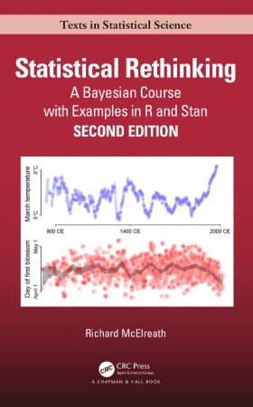

```{r setup, include=FALSE}
# knitr::opts_chunk$set(echo = FALSE)
knitr::opts_chunk$set(fig.width=5.5, fig.height=5.5, collapse = TRUE, comment = "##", dev="png")
library(igraph)
library(ggplot2)
library(ggnetwork)
library(rstan)
# library(data.table)
# library(mvtnorm)
# library(plotly)
options(digits=3)

# library(xtable)
```

## Regression problems

::: {.columns}
:::: {.column}

* Many applied problems take the form of a set of observations $y$ along with one or more covariates $x$
* We want to know how $y$ changes (on average) with $x$, and how much variance there is in $y$

::::
:::: {.column}

```{r echo = FALSE, fig.width=4, fig.height=9}
n = 50
x = runif(n, -1, 1)
a = 0.5
b1 = 2.7; b2 = 2.1; b3 = 3.7
s = 1.4
y1 = rnorm(n, a + b1 * x, s)
y2 = rpois(n, exp(a + b2 * x))
y3 = rbinom(n, 1, plogis(a + b3 * x))

par(mfrow = c(3, 1), bty='n', mar=c(4,4,0,0))
plot(x, y1, pch=16, ylab=expression(y[1]), xlab="")
plot(x, y2, pch=16, ylab=expression(y[2]), xlab="")
plot(x, y3, pch=16, ylab=expression(y[3]), xlab="x")

```

::::
:::


## Regression problems

::: {.columns}
:::: {.column}
* We can draw a line through the points that minimizes the sum of squared residuals $\sum_i (y_i - \mathbb{E}[y|x_i])^2$
* $\mathbb{E}[y|x_i]$ is the expectation of $y$ conditional on x
   - what do we expect $y$ to be, on average, for any value of $x$


::::
:::: {.column}


```{r echo = FALSE, fig.width=4, fig.height=9}

xpr = seq(min(x), max(x), length.out=100)
par(mfrow = c(3, 1), bty='n', mar=c(4,4,0,0))
plot(x, y1, pch=16, ylab=expression(y[1]), xlab="")
lines(xpr, a + b1*xpr, col='red', lwd=2)
plot(x, y2, pch=16, ylab=expression(y[2]), xlab="")
lines(xpr, exp(a + b2*xpr), col='red', lwd=2)
plot(x, y3, pch=16, ylab=expression(y[3]), xlab="x")
lines(xpr, plogis(a + b3*xpr), col='red', lwd=2)


```

::::
:::


## Regression problems

::: {.columns}
:::: {.column}

* We can draw a line through the points that minimizes the sum of squared residuals $\sum_i (y_i - \mathbb{E}[y|x_i])^2$
* $\mathbb{E}[y|x_i]$ is the expectation of $y$ conditional on x
   - what do we expect $y$ to be, on average, for any value of $x$
* This line has two parameters, an intercept $a$ and a slope $b$
   - $\mathbb{E}(y|x_i)  = a + bx_i$


::::
:::: {.column}


```{r echo = FALSE, fig.width=5, fig.height=5}
xex = -0.3
ypr = function(xx) a + b1*xx 
par(bty='n', mar=c(4,4,0,0))
plot(x, y1, pch=16, cex=0.8, col="#777777", ylab="y", xlab="x")
lines(xpr, ypr(xpr), col='red', lwd=2)
points(xex, ypr(xex), col='blue', pch=16, cex=2)
legend("bottomright", legend=paste("x =", xex), bty='n', pch=16, cex=1.3, col='blue')
```


::::
:::


## Regression problems

::: {.columns}
:::: {.column}

* We can draw a line through the points that minimizes the sum of squared residuals $\sum_i (y_i - \mathbb{E}[y|x_i])^2$
* $\mathbb{E}[y|x_i]$ is the expectation of $y$ conditional on x
   - what do we expect $y$ to be, on average, for any value of $x$
* This line has two parameters, an intercept $a$ and a slope $b$
   - $\mathbb{E}(y|x_i)  = a + bx_i$
* $y \sim \mathcal{N}(a + bx, s)$
   - "y is distributed as"


::::
:::: {.column}


```{r echo = FALSE, fig.width=5, fig.height=5}
par(bty='n', mar=c(4,4,0,0))
plot(x, y1, pch=16, cex=0.8, col="#777777", ylab="y", xlab="x")
lines(xpr, ypr(xpr), col='red', lwd=2)
legend("bottomright", legend=paste("x =", xex), bty='n', pch=16, cex=1.3, col='blue')

yex = ypr(xex) + seq(-1.25, 1.25, 0.25)*s
ycex = dnorm(yex, ypr(xex), s)
ycex = 2 * ycex / max(ycex)
points(rep(xex, length(yex)), yex, col='blue', pch=16, cex=ycex)
```


::::
:::


## Regression problems

::: {.columns}
:::: {.column}

* We can draw a line through the points that minimizes the sum of squared residuals $\sum_i (y_i - \mathbb{E}[y|x_i])^2$
* $\mathbb{E}[y|x_i]$ is the expectation of $y$ conditional on x
   - what do we expect $y$ to be, on average, for any value of $x$
* This line has two parameters, an intercept $a$ and a slope $b$
   - $\mathbb{E}(y|x_i)  = a + bx_i$
* $y \sim \mathcal{N}(a + bx, s)$
   - "y is distributed as"
* Key assumptions:
   - $y$ is *iid*
   - $y$ has constant variance with respect to $x$
   - the residuals are normally distributed (or $y|x$ is normally distributed)


::::
:::: {.column}


```{r echo = FALSE, fig.width=5, fig.height=5}
par(bty='n', mar=c(4,4,0,0))
plot(x, y1, pch=16, cex=0.8, col="#777777", ylab="y", xlab="x")
lines(xpr, ypr(xpr), col='red', lwd=2)
legend("bottomright", legend=paste("x =", xex), bty='n', pch=16, cex=1.3, col='blue')

yex = ypr(xex) + seq(-1.25, 1.25, 0.25)*s
ycex = dnorm(yex, ypr(xex), s)
ycex = 2 * ycex / max(ycex)
points(rep(xex, length(yex)), yex, col='blue', pch=16, cex=ycex)
```


::::
:::


## Graphing the model

::: {.columns}
:::: {.column}

* It is always a good idea to graph your model
* The graph represents *knowns* and *unknowns* as **nodes**, with relationships as **edges**
* Variables (**nodes**) may be either *stochastic* or *deterministic* 
* Your model must estimate all unknowns
   - **stochastic unknowns** are usually parameters
   - **deterministic unknowns** must be computed somewhere in your model
   - **stochastic knowns** usually appear as the first parameter is a probability statement like `dnorm`
   
::::
:::: {.column}


```{r, echo = FALSE}
gr = graph_from_literal(a-+"E(y)", b-+"E(y)", s-+y, x-+"E(y)", "E(y)"-+y)
V(gr)$type = c("stochastic", "deterministic", "stochastic", "stochastic", "stochastic", "deterministic")
V(gr)$source = c("unknown", "unknown", "unknown", "unknown", "known", "known")
layout = matrix(c(0.5,2,  0.5,1,  1,2,  1.5,2,  1.25,0, 0,2), byrow=TRUE, ncol=2)


n = ggnetwork(gr, layout=layout)
pl = ggplot(n, aes(x = x, y = y, xend = xend, yend = yend)) + 
   geom_edges(colour="gray50", arrow=arrow(length = unit(6, "pt"), type = "closed")) + 
   theme_blank() + geom_nodes(aes(color=type, shape = source), size=6) + 
   geom_nodelabel(aes(label = name), fontface = "bold", nudge_x=-0.1)
pl
```

::::
:::


## Graphing the model

::: {.columns}
:::: {.column}

* Bayesian models that can be fit in Stan are **directed acyclic graphs**
* Can draw them by hand, or use `igraph` and `ggnetwork`

```{r eval = FALSE}
library("igraph")
library("ggnetwork")

# Here we define the edges
# -+ is an arrow you want to draw (+ is the arrowhead)
# Nodes are created implicitly; name it here and it will be added
gr = graph_from_literal(a-+"E(y)", b-+"E(y)", s-+y, x-+"E(y)", "E(y)"-+y)

# Here we define two attributes, type and source
# These are assigned to nodes using the V (for Vertex) function
# The order is defined by the order the nodes appear when the graph is created
V(gr)$type = c("stochastic", "deterministic", "stochastic", 
			   "stochastic", "stochastic", "deterministic")
V(gr)$source = c("unknown", "unknown", "unknown", 
				 "unknown", "known", "known")

# Here we define an optional layout, telling ggnetwork where to put each node
# The matrix should have one row per node, and columns are x and y coordinates
# If you skip this, ggnetwork will try to make a pretty graph by itself
layout = matrix(c(0.5,2,  0.5,1,  1,2,  1.5,2,  1.25,0, 0,2), 
				byrow=TRUE, ncol=2)


n = ggnetwork(gr, layout=layout)
(pl = ggplot(n, aes(x = x, y = y, xend = xend, yend = yend)) + 
   geom_edges(colour="gray50", arrow=arrow(length = unit(6, "pt"), 
   								type = "closed")) + 
   theme_blank() + geom_nodes(aes(color=type, shape = source), size=6) + 
   geom_nodelabel(aes(label = name), fontface = "bold", nudge_x=-0.1))
```

::::
:::: {.column}


```{r echo = FALSE}
pl
```

::::
:::


## Using the graph

::: {.columns}
:::: {.column}

* You can use the graph to help you design your Stan code!

1. Start with an empty model
2. Simple guideline: everything in your graph **must** either:
	- Appear on the left side of the `~` symbol (stochastic nodes)
	- Appear on the left side of the `=` symbol (deterministic unknowns)
	- Appear in the `data` block (everything else)
	- Stochastic variables that are also measured will be in `data` **and** on the left side of `~`\

```{stan output.var = "lm", eval = FALSE}
data {

}
parameters {

}
transformed parameters {

}
model {

}
```

::::
:::: {.column}


```{r echo = FALSE}
pl
```

::::
:::


## Using the graph

::: {.columns}
:::: {.column}

3. I will start at the bottom, with `y`. I will **define** the distribution of `y`. 
	- In our graph, `y` has two dependencies (`eta` and `s`); these should appear on the right side of the expression for `y`.
	- I also need to `declare` the variable (i.e., tell Stan what kind of variable `y` is)
	- Here `y` is a **vector**. How does this differ from an **array**?
	- A **vector** is always a 1-dimensional sequence of real numbers!

Syntax:

	| real y [n];   // array of n real numbers
	| vector [n] y; // vector of n real numbers

```{stan output.var = "lm", eval = FALSE}
data {
	vector [n] y;
}
parameters {

}
transformed parameters {

}
model {
	y ~ normal(eta, s);
}
```

::::
:::: {.column}


```{r echo = FALSE}
pl
```

::::
:::

## Using the graph

::: {.columns}
:::: {.column}

4. Everything I used to declare/define `y` now needs it's own declaration and definition.
	- Here we do `s` and `n`, which have no dependencies.

```{stan output.var = "lm", eval = FALSE}
data {
	int <lower = 1> n;
	vector [n] y;
}
parameters {
	real <lower = 0> s;
}
transformed parameters {

}
model {
	y ~ normal(eta, s);
	s ~ exponential(0.1);
}
```

::::
:::: {.column}


```{r echo = FALSE}
pl
```

::::
:::


## Using the graph

::: {.columns}
:::: {.column}

5. Iterate, following each dependency until everything on the graph is in the model

```{stan output.var = "lm", eval = FALSE}
data {
	int <lower = 1> n;
	vector [n] y;
}
parameters {
	real <lower = 0> s;
}
transformed parameters {
	vector [n] eta;
	eta = a + b * x;
}
model {
	y ~ normal(eta, s);
	s ~ exponential(0.1);
}
```

::::
:::: {.column}


```{r echo = FALSE}
pl
```

::::
:::


## Using the graph

::: {.columns}
:::: {.column}

5. Iterate, following each dependency until everything on the graph is in the model

```{stan output.var = "lm", eval = FALSE}
data {
	int <lower = 1> n;
	vector [n] y;
	vector [n] x;
}
parameters {
	real <lower = 0> s;
	real a;
	real b;
}
transformed parameters {
	vector [n] eta;
	eta = a + b * x;
}
model {
	y ~ normal(eta, s);
	s ~ exponential(0.1);
	a ~ normal(0, 10);
	b ~ normal(0, 5);
}
```

::::
:::: {.column}


```{r echo = FALSE}
pl
```

::::
:::


## What to put where??

These are guidelines not strict rules...

::: {.columns}
:::: {.column}

```{stan output.var = "lm", eval = FALSE}
data {
	// declaration of all knowns
}
parameters {
	// declaration of all stochastic unkowns
}
transformed parameters {
	// declaration and definition of deterministic unknowns
}
model {
	// definition of all unknowns
}
```

::::
:::: {.column}


```{r echo = FALSE}
pl
```

::::
:::


## Fitting to the Penguins


::: {.columns}
:::: {.column}

{width=75}
{width=150}

```{r echo = FALSE, warning = FALSE}
penguins = as.data.frame(palmerpenguins::penguins)
penguins = subset(penguins, complete.cases(penguins) & species == "Gentoo")
(pl = ggplot(penguins) + geom_point(aes(x = bill_length_mm, y = bill_depth_mm, colour = species)) + 
	theme_minimal() + xlab("Bill Length (mm)") + ylab("Bill Depth (mm)"))

```

::::
:::: {.column}

```{stan output.var = "peng_lm", cache = TRUE}
data {
	int <lower = 1> n;
	vector [n] bill_depth;
	vector [n] bill_len;
}
parameters {
	real <lower = 0> s;
	real a;
	real b;
}
transformed parameters {
	vector [n] eta;
	eta = a + b * bill_len;
}
model {
	bill_depth ~ normal(eta, s);
	s ~ exponential(0.1);
	a ~ normal(0, 10);
	b ~ normal(0, 5);
}
```

::::
:::


## Fitting to the Penguins


::: {.columns}
:::: {.column}


{width=75}
{width=150}

```{r echo = FALSE, warning = FALSE}
pl + geom_abline(intercept =5.1, slope = 0.21, col = "#841D15", linewidth = 1.5)

```

::::
:::: {.column}

```{r eval = FALSE}
library(rstan)
peng_lm = stan_model("stan/penguin_lm.stan")
```

```{r cache = TRUE}
penguins = as.data.frame(palmerpenguins::penguins)
penguins = subset(penguins, complete.cases(penguins) & species == "Gentoo")
peng_dat = with(penguins, list(
	bill_len = bill_length_mm,
	bill_depth = bill_depth_mm,
	n = length(bill_length_mm)
))
peng_fit = sampling(peng_lm, data = peng_dat, refresh = 0)
print(peng_fit, pars = c("a", "b", "s"))

```

::::
:::


## More linear models

::: {.columns}
:::: {.column}

* Our linear model used a single x-variable: $\mathbb{E}(y) = a + bx$
* It is trivial to add additional predictors to a model: $\mathbb{E}(y) = a + b_1x_1 + b_2x_2 + \dots + b_nx_n$

::::
:::: {.column}

::::
:::

## Adding a Curve

::: {.columns}
:::: {.column}

* Our linear model used a single x-variable: $\mathbb{E}(y) = a + bx$
* It is trivial to add additional predictors to a model: $\mathbb{E}(y) = a + b_1x_1 + b_2x_2 + \dots + b_nx_n$
* One reason to do this is to add a curve: we could add a new variable called $x^2$

$$
\mathbb{E}(y) = a + b_1x + b_2x^2
$$

::::: {.small}
Dataset: Nancy Howell (Univ. Toronto) | Measurements of the Dobe !Kung people | Republished in [McElreath 2020](https://github.com/rmcelreath/rethinking)

{height=200px}
{height=200px}

:::::


::::
:::: {.column}


```{r message = FALSE, cache = TRUE}
library(data.table)
kung = fread("https://github.com/rmcelreath/rethinking/raw/master/data/Howell1.csv")
(pl = ggplot(data = kung, aes(x = weight, y = height)) + geom_point(col = "#555555aa", size = 0.9) +
	geom_smooth(method = "lm", col = "blue", linewidth = 1.5, se = FALSE) +
	geom_smooth(method = "lm", col = "red", linewidth = 0.8, lty = 2, formula = y~x+I(x^2), se = FALSE) +
	theme_minimal())

```

::::
:::


## Adding a Curve

::: {.columns}
:::: {.column}

* Our linear model used a single x-variable: $\mathbb{E}(y) = a + bx$
* It is trivial to add additional predictors to a model: $\mathbb{E}(y) = a + b_1x_1 + b_2x_2 + \dots + b_nx_n$
* One reason to do this is to add a curve: we could add a new variable called $x^2$

$$
\mathbb{E}(y) = a + b_1x + b_2x^2
$$

* Use caution: curves can predict silly things
   - does it make sense that height decreases after a certain weight?
* This is still a linear model: $\mathbb{E}(y)$ is linear with respect to transformations of x


::::
:::: {.column}


```{r echo = FALSE, message = FALSE}
pl
```

::::
:::


## Interactions

::: {.columns}
:::: {.column}

* If we multiply predictors, we produce **interactions**

**Important**: Always remember main effects if including interactions

$$
\mathbb{E}(height) = a + b_1 \times weight + b_2 \times age + b_3 \times weight \times age
$$

::::
:::: {.column}


```{r echo = FALSE, message = FALSE, fig.width = 7}
prdat = data.frame(
	weight = c(seq(10, 19, length.out = 10), seq(15, 33, length.out = 10), 
			   seq(30, 60, length.out = 10), seq(30, 60, length.out = 10)),
	age = rep(c(5, 10, 25, 45), each = 10)
)
mod = lm(height ~ weight * age, data = kung)
prdat$height = coef(mod)[1] + coef(mod)[2] * prdat$weight + coef(mod)[3] * prdat$age + 
	coef(mod)[4] * prdat$weight  * prdat$age  

(pl2 = ggplot(data = kung, aes(x = weight, y = height)) + geom_point(col = "#555555aa", size = 0.9) +
		geom_line(data = prdat, aes(x = weight, y = height, col = as.factor(age)), linewidth = 1.5) + 
		theme_minimal()) + guides(color=guide_legend(title="Age"))

```

::::
:::


## Categorical Variables

* Categorical variables also fit into this scheme
* However, we need to consider how we want to model the categories!
	- Not as simple as assigning numbers to each category and creating the model

::: {.columns}
:::: {.column}


{width=75}
{width=150}


::::
:::: {.column}

```{r echo = FALSE, warning = FALSE, fig.width = 7}
penguins = as.data.frame(palmerpenguins::penguins)
penguins = penguins[complete.cases(penguins),]
(pl = ggplot(penguins) + geom_point(aes(x = bill_length_mm, y = bill_depth_mm, colour = species)) + 
	theme_minimal() + xlab("Bill Length (mm)") + ylab("Bill Depth (mm)"))

```

$$
depth = a + b_1 \times length + b_2 \times species??
$$
::::
:::


## Categorical Variables


::: {.columns}
:::: {.column}

* Categorical variables also fit into this scheme
* However, we need to consider how we want to model the categories!
* We use **dummy coding**
* First assign a reference category - here we will use Adelie
	- The intercept becomes the intercept only for this category
	- So Adelie penguins have an intercept = a
* Then create binary columns indicating the other two categories
	- "Intercept" for each category will be $a + $ some **offset**
	- E.g., for Chinstrap, the intercept is $a + b_2$


::::
:::: {.column}

```{r}
penguins$chinstrap = ifelse(penguins$species == 'Chinstrap', 1, 0)
penguins$gentoo = ifelse(penguins$species == 'Gentoo', 1, 0)
```

```{r echo = FALSE, warning = FALSE, fig.width = 7}
mod = lm(bill_depth_mm ~ bill_length_mm + species, data = penguins)
prdat = data.frame(
	bill_length_mm = c(30, 48, 40, 58, 40, 60),
	species = c("Adelie", "Adelie", "Chinstrap", "Chinstrap", "Gentoo", "Gentoo")
)
prdat$bill_depth_mm = predict(mod, newdata = prdat)
(pl = ggplot(penguins) + geom_point(aes(x = bill_length_mm, y = bill_depth_mm, colour = species)) + 
	theme_minimal() + xlab("Bill Length (mm)") + ylab("Bill Depth (mm)")) + 
	geom_line(data = prdat, aes(x = bill_length_mm, y = bill_depth_mm, colour = species))

```


$$
depth = a + b_1 \times length + b_2 \times chinstrap + b_3 \times gentoo
$$
::::
:::


## Categorical Variables


::: {.columns}
:::: {.column}

* Categorical variables also fit into this scheme
* However, we need to consider how we want to model the categories!
* We use **dummy coding**
* First assign a reference category - here we will use Adelie
	- The intercept becomes the intercept only for this category
	- So Adelie penguins have an intercept = a
* Then create binary columns indicating the other two categories
	- "Intercept" for each category will be $a + $ some **offset**
	- E.g., for Chinstrap, the intercept is $a + b_2$
* We can use interactions to give each category it's own slope


::::
:::: {.column}

```{r}
penguins$chinstrap = ifelse(penguins$species == 'Chinstrap', 1, 0)
penguins$gentoo = ifelse(penguins$species == 'Gentoo', 1, 0)
```

```{r echo = FALSE, warning = FALSE, fig.width = 7}
mod = lm(bill_depth_mm ~ bill_length_mm * species, data = penguins)
prdat = data.frame(
	bill_length_mm = c(30, 48, 40, 58, 40, 60),
	species = c("Adelie", "Adelie", "Chinstrap", "Chinstrap", "Gentoo", "Gentoo")
)
prdat$bill_depth_mm = predict(mod, newdata = prdat)
(pl = ggplot(penguins) + geom_point(aes(x = bill_length_mm, y = bill_depth_mm, colour = species)) + 
	theme_minimal() + xlab("Bill Length (mm)") + ylab("Bill Depth (mm)")) + 
	geom_line(data = prdat, aes(x = bill_length_mm, y = bill_depth_mm, colour = species))

```


::::
:::


$$
depth = a + b_1 \times length + b_2 \times chinstrap + b_3 \times gentoo + b_4 \times chinstrap \times length + b_5 \times gentoo \times length
$$


## Matrix Notation

::: {.columns}
:::: {.column}

* Since our model is a linear system, we can use linear algebra to describe it
* This will greatly simplify the Stan code!
* **X** is a matrix of predictors, one row per observation, one column per variable
	- Include transformations! If you have $x$ and $x^2$, these are separate columns!
	- Dummy coded categories also get one category each **except** the reference category
* **B** is a vector of parameters, one parameter per variable
* **XB** (using matrix multiplication) returns $b_1x_1 + b_2x_2 + \dots$
* Now you can change the predictors in your model without changing the model code!

$$
	\eta = \mathbb{E}(y) = a + \mathbf{XB}
$$
::::
:::: {.column}

```{stan output.var = "lm_matrix", eval = FALSE}
data {
	int <lower = 1> k; // number of predictor variables
	int <lower = 1> n;
	matrix [n, k] X;
	vector [n] y;
}
parameters {
	real <lower = 0> s;
	vector [k] B;
}
transformed parameters {
	vector eta = a + X * B;
}
model {
	y ~ normal(eta, s);
	s ~ exponential(0.1);
	a ~ normal(0, 10);
	B ~ normal(0, 5); // prior here is vectorised, we use the same for each B!
}
```

::::
:::


## Further generalising our model

::: {.columns}
:::: {.column}

* A motivating example: *Tsuga canadensis* mortality in eastern North America.
	- Hemlock seems to prefer moderate temperatures and high precipitation.

**Research question:** Does mortality decrease with increasing precipitation?

We can visualise this by computing the proportion of trees that died in each plot.

::::: {.small}
Dataset: [Talluto et al 2017](https://www.nature.com/articles/s41559-017-0182)

{height=350px}

:::::


::::
:::: {.column}


```{r, warning = FALSE, fig.width = 6, fig.height = 4}
tsuga = readRDS("../vu_advstats_students/data/tsuga.rds")
head(tsuga[, 4:8])
tsuga$mortality = tsuga$died / tsuga$n
(mort_pl = ggplot(tsuga) + geom_point(aes(x = tot_annual_pp, y = mortality, size = n)) + 
	xlab("Annual precipitation (mm)") + theme_minimal() +
	scale_size_binned(range = c(0.05, 3)))
```

::::
:::


## Mortality in Tsuga

::: {.columns}
:::: {.column}

**Research question:** Does mortality decrease with increasing precipitation?

* We already used a binomial likelihood to model mortality. What if we modify our linear model this way?
	- Our respnose variable is $d$, the number of trees dying, which must be conditioned on $n$, the number of trees that could die.


::::
:::: {.column}


```{r, warning = FALSE, fig.width = 6, fig.height = 4, echo = FALSE}
mort_pl
```

::::
:::


## Mortality in Tsuga

::: {.columns}
:::: {.column}

**Research question:** Does mortality decrease with increasing precipitation?

* We already used a binomial likelihood to model mortality. What if we modify our linear model this way?
	- Our respnose variable is $d$, the number of trees dying, which must be conditioned on $n$, the number of trees that could die.
	- For the binomial distribution, we already saw that $\mathbb{E}(d|n) = \frac{d}{n} = p$, where $p$ is the probability of an event


::::
:::: {.column}

```{r, warning = FALSE, fig.width = 6, fig.height = 4, echo = FALSE}
mort_pl
```

::::
:::


## Mortality in Tsuga: Graphical model

::: {.columns}
:::: {.column}

**Research question:** Does mortality decrease with increasing precipitation?

* We already used a binomial likelihood to model mortality. What if we modify our linear model this way?
	- Our respnose variable is $d$, the number of trees dying, which must be conditioned on $n$, the number of trees that could die.
	- For the binomial distribution, we already saw that $\mathbb{E}(d|n) = \frac{d}{n} = p$, where $p$ is the probability of an event
	- We can simply model this with a linear function as before, right?

$$
	\begin{aligned}
		\eta_i & = \mathbb{E}(d_i|n_i) = a + b \times precip_i \\
		d_i & \sim  \mathrm{Binomial}(n_i, \eta_i)
	\end{aligned}
$$

::::
:::: {.column}


```{r, warning = FALSE, fig.width = 6, fig.height = 4, echo = FALSE}
gr = graph_from_literal(a-+η, b-+η, precip-+η, η-+died, n-+died)
V(gr)$type = c("stochastic", "deterministic", "stochastic", "deterministic", "stochastic", "deterministic")
V(gr)$source = c("unknown", "unknown", "unknown", "known", "known", "known")
layout = matrix(c(0,2,  0.5,1, 0.5,2, 1,2, 1.25,0, 1.5,2), byrow=TRUE, ncol=2)
nt = ggnetwork(gr, layout=layout)
grpl = ggplot(nt, aes(x = x, y = y, xend = xend, yend = yend)) + 
   geom_edges(colour="gray50", arrow=arrow(length = unit(6, "pt"), type = "closed")) + 
   theme_blank() + geom_nodes(aes(color=type, shape = source), size=6) + 
   geom_nodelabel(aes(label = name), fontface = "bold", nudge_x=-0.1)
grpl


```

::::
:::


## Mortality in Tsuga: Stan code

::: {.columns}
:::: {.column}

**Research question:** Does mortality decrease with increasing precipitation?
$$
	\begin{aligned}
		\eta_i & = \mathbb{E}(d_i|n_i) = a + b \times precip_i \\
		d_i & \sim  \mathrm{Binomial}(n_i, \eta_i)
	\end{aligned}
$$
::::
:::: {.column}


```{stan output.var = "mort_binom1", cache = TRUE}
data {
	int <lower = 1> nobs;
	vector [nobs] precip;
	int <lower = 1> n [nobs];
	int <lower = 0> died [nobs];
}
parameters {
	real a;
	real b;
}
transformed parameters {
	vector [nobs] eta = a + b * precip;
}
model {
	died ~ binomial(n, eta);
	a ~ normal(0, 10);
	b ~ normal(0, 10);
}
```

::::
:::

## Mortality in Tsuga: Running the model

::: {.columns}
:::: {.column}

**Research question:** Does mortality decrease with increasing precipitation?
$$
	\begin{aligned}
		\eta_i & = \mathbb{E}(d_i|n_i) = a + b \times precip_i \\
		d_i & \sim  \mathrm{Binomial}(n_i, \eta_i)
	\end{aligned}
$$


``` {r cache = TRUE, error = FALSE}
# drop NAs from the dataset, drop plots with no trees
tsuga_stan_dat = with(tsuga[n > 0 & complete.cases(tsuga), ], list(
	died = died,
	n = n,
	precip = tot_annual_pp
))
tsuga_stan_dat$nobs = length(tsuga_stan_dat$n)
tsuga_fit1 = sampling(mort_binom1, data = tsuga_stan_dat, refresh = 0)

tsuga_fit1 = sampling(mort_binom1, data = tsuga_stan_dat, refresh = 0, 
					  init = list(list(a = 0.46, b = -2.5e-4)), chains=1)

```

::::
:::: {.column}


```{r, warning = FALSE, fig.width = 6, fig.height = 4, echo = FALSE, cache = TRUE}
samps = as.matrix(tsuga_fit1, pars = c('a', 'b'))
quants = apply(samps, 2, quantile, c(0.05, 0.5, 0.95))
prdat = data.frame(precip = seq(min(tsuga$tot_annual_pp), max(tsuga$tot_annual_pp), length.out = 500))
prdat$fit1 = quants[2,1] + quants[2,2] * prdat$precip
prdat$fit1_l = quants[1,1] + quants[1,2] * prdat$precip
prdat$fit1_u = quants[3,1] + quants[3,2] * prdat$precip

cols = scales::hue_pal()(2)
(mort_pl_fit1 = mort_pl + geom_ribbon(data = prdat, aes(x = precip, ymin = fit1_l, ymax = fit1_u), 
					  col = cols[1], fill = paste0(cols[1], "66"), size = 0.6) + 
	geom_line(data = prdat, aes(x = precip, y = fit1), col = cols[1], size = 1.5))
```


::::
:::


## Improving the fit

::: {.columns}
:::: {.column}

**Research question:** Does mortality decrease with increasing precipitation?

**Problem:** This system cannot be linear!

$$
	\begin{aligned}
		\eta_i & = \mathbb{E}(d_i|n_i) = a + b \times precip_i \\
		d_i & \sim  \mathrm{Binomial}(n_i, \eta_i)
	\end{aligned}
$$


::::
:::: {.column}


```{r, warning = FALSE, fig.width = 6, fig.height = 4, echo = FALSE}
mort_pl_fit1

```


::::
:::


## Improving the fit: adding a link function

::: {.columns}
:::: {.column}

**Research question:** Does mortality decrease with increasing precipitation?

**Problem:** This system cannot be linear!

**Solution:** Transform the linear equation to fit the response using a **link function**

$$
	\begin{aligned}
		\eta & = a + b \times precip \\
		\mathcal{f}(p) & = \mathcal{f}(\mathbb{E}[d|n]) = \eta & \mathrm{or} \\
		p & = \mathbb{E}[d|n] = \mathcal{f}^{-1}(\eta) \\
		d & \sim  \mathrm{Binomial}(n, p)
	\end{aligned}
$$


::::
:::: {.column}


```{r, warning = FALSE, fig.width = 6, fig.height = 4, echo = FALSE}
mort_pl_fit1
```


::::
:::


## Improving the fit: adding a link function

::: {.columns}
:::: {.column}

**Research question:** Does mortality decrease with increasing precipitation?

**Problem:** This system cannot be linear!

**Solution:** Transform the linear equation to fit the response using a **link function**

Here we need a sigmoid function. A common one for binomial problems is the log odds, or **logit** function.

$$
	\begin{aligned}
		\ln \frac{p}{1-p} & = \eta = a + b \times precip \\
		p & = \frac{e^{\eta}}{1 + e^{\eta}} & \\
		d & \sim  \mathrm{Binomial}(n, p)
	\end{aligned}
$$


::::
:::: {.column}


```{r, warning = FALSE, fig.width = 6, fig.height = 4, echo = FALSE}
mort_pl_fit1
```


::::
:::


## Improving the fit: Stan round 2

::: {.columns}
:::: {.column}

**Research question:** Does mortality decrease with increasing precipitation?
$$
	\begin{aligned}
		\ln \frac{p}{1-p} & = \eta = a + b \times precip \\
		p & = \frac{e^{\eta}}{1 + e^{\eta}} & \\
		d & \sim  \mathrm{Binomial}(n, p)
	\end{aligned}
$$

::::
:::: {.column}

```{stan output.var = "mort_binom2", cache = TRUE}
data {
	int <lower = 1> nobs;
	vector [nobs] precip;
	int <lower = 1> n [nobs];
	int <lower = 0> died [nobs];
}
parameters {
	real a;
	real b;
}
transformed parameters {
	vector [nobs] eta = a + b * precip;
	vector <lower = 0, upper = 1> [nobs] p = inv_logit(eta);
}
model {
	died ~ binomial(n, p);
	a ~ normal(0, 10);
	b ~ normal(0, 10);
}
```

::::
:::

## Improving the fit: Stan round 2

::: {.columns}
:::: {.column}

**Research question:** Does mortality decrease with increasing precipitation?
$$
	\begin{aligned}
		\ln \frac{p}{1-p} & = \eta = a + b \times precip \\
		p & = \frac{e^{\eta}}{1 + e^{\eta}} & \\
		d & \sim  \mathrm{Binomial}(n, p)
	\end{aligned}
$$

::::
:::: {.column}


``` {r cache = TRUE}
tsuga_fit2 = sampling(mort_binom2, data = tsuga_stan_dat, refresh = 0)
```

```{r, warning = FALSE, fig.width = 6, fig.height = 4, echo = FALSE, cache = TRUE}
samps = as.matrix(tsuga_fit2, pars = c('a', 'b'))
quants = apply(samps, 2, quantile, c(0.05, 0.5, 0.95))
prdat = data.frame(precip = seq(min(tsuga$tot_annual_pp), max(tsuga$tot_annual_pp), length.out = 500))
prdat$fit1 = plogis(quants[2,1] + quants[2,2] * prdat$precip)
prdat$fit1_l = plogis(quants[1,1] + quants[1,2] * prdat$precip)
prdat$fit1_u = plogis(quants[3,1] + quants[3,2] * prdat$precip)

cols = scales::hue_pal()(2)
mort_pl + geom_ribbon(data = prdat, aes(x = precip, ymin = fit1_l, ymax = fit1_u), 
					  col = cols[2], fill = paste0(cols[2], "66"), size = 0.6) + 
	geom_line(data = prdat, aes(x = precip, y = fit1), col = cols[2], size = 1.5)
```


::::
:::


## The Generalised Linear Model

For an observed variable $y$:


## The Generalised Linear Model

For an observed variable $y$ and a matrix of predictors $\mathbf{X}$:

1. We can define the conditional expectation of $y$:

$$
	\mathbb{E}(y | \mathbf{X}) = \xi
$$


## The Generalised Linear Model

For an observed variable $y$ and a matrix of predictors $\mathbf{X}$:

1. We can define the conditional expectation of $y$.
2. This expectation is connected to a **linear predictor** via a **link function** $\mathcal{f}$
	- With optional additional parameters $\theta_{\mathcal{f}}$

$$
\begin{aligned}
	\mathbb{E}(y | \mathbf{X}) & = \xi \\
	\mathcal{f}(\xi, \theta_{\mathcal{f}}) & = \eta \\
	\eta & = \mathbf{XB}\\
\end{aligned}
$$


## The Generalised Linear Model

For an observed variable $y$ and a matrix of predictors $\mathbf{X}$:

1. We can define the conditional expectation of $y$.
2. This expectation is connected to a **linear predictor** via a **link function** $\mathcal{f}$
	- With optional additional parameters $\theta_{\mathcal{f}}$
3. Randomness in our observation of $y$ is **generated** by some **distribution function** $\mathcal{D}$
	- $\mathcal{D}$ has optional free parameters $\theta_{\mathcal{D}}$
	- Often $\theta_{\mathcal{D}}$ will include dispersion parameters

$$
\begin{aligned}
	\mathbb{E}(y | \mathbf{X}) & = \xi \\
	\mathcal{f}(\xi, \theta_{\mathcal{f}}) & = \eta \\
	\eta & = \mathbf{XB}\\
	\\
	y & \sim \mathcal{D}(\xi, \theta_{\mathcal{D}})
\end{aligned}
$$


## Example: The Gaussian model

For an observed variable $y$ and a matrix of predictors $\mathbf{X}$:

1. We can define the conditional expectation of $y$.
2. The link function is the **identity function**
	- Which has no additional parameters ($\theta_{\mathcal{f}} = \varnothing$)
3. Randomness in our observation of $y$ is **generated** by the **Gaussian** (i.e., Normal) PDF
	- Which has the additional free standard deviation parameter $s$: $\theta_{\mathcal{D}} = \{s\}$

This is identical to our linear model from earlier! Multiple regression is a subset of the GLM.

$$
\begin{aligned}
	\mathbb{E}(y | \mathbf{X}) & = \xi \\
	\mathcal{I}(\xi) & = \eta \\
	\eta & = \mathbf{XB} \\ & \therefore\\
	\mathbb{E}(y | \mathbf{X}) & = \mathbf{XB}\\
	\\
	y & \sim \mathcal{N}(\mathbf{XB}, s)
\end{aligned}
$$


## Count Data: Poisson

* For counts where the number of trials is unkown or nonsensical, where we speak of a rate of occurrence rather than probability
	- Number of species/indiviuduals in a plot
	- Incidence of a disease with an (effectively) infinite population
* The expectation $\lambda$ is the **rate of observation**
* Log link function

$$
\begin{aligned}
\lambda & = \exp(a + \mathbf{BX}) \\
y & \sim \mathrm{Poisson}(\lambda)
\end{aligned}
$$

**Assumption:** $\sigma^2_{y|\mathbf{X}} = \mathbb{E}(y|\mathbf{X}) = \lambda$

* Sometimes, *exposure* varies by observation.
   - Different size plots
   - Different observation times
   - We add an exposure variable in this case, **u**
   - In traditional modelling, $\log u$ is called the *offset*
   
$$
y \sim \mathrm{Poisson}(u\lambda)
$$


## Overdispersed counts: Negative Binomial

* For counts where the mean and variance are not equal
* Typical in ecological count data (e.g., abundances)

$$
\begin{aligned}
\xi & = \exp(a + \mathbf{BX}) \\
y & \sim \mathrm{NB}(\xi, \phi)
\end{aligned}
$$

$\phi$ is called the dispersion parameter, and is related to the variance:

$$
\sigma^2_{y|\mathbf{X}} = \xi + \frac{\xi^2}{\phi}
$$


## Proportions: Beta

* When we have true proportions (i.e., a number of trials is unavailable)
	- Proportion cover
* Also used for Binomial problems where the number of trials is missing/unrecorded
* If number of trials is available, **always** prefer Binomial GLM

$$
\begin{aligned}
\xi & = \mathrm{logit}^{-1}(a_\rho + \mathbf{B_\rho X_\rho}) \\
\phi & = \exp(a_\phi + \mathbf{B_\phi X_\phi}) & \mathrm{\small optionally} \\
\alpha & = \xi\phi \\
\beta & = (1 - \xi)\phi \\
y & \sim \mathrm{Beta}(\alpha, \beta)
\end{aligned}
$$

### Caveats & Hints

* $\phi$ is the **precision**; $\sigma^2_{y|\mathbf{X}} = \frac{\xi(1-\xi)}{\phi + 1}$
* All *observations* of $y$ must be on (0, 1). Values of exactly 0 or 1 are not allowed
* Finite mixtures can be used if the data contain 0s and 1s.
* $\alpha$: expected number of successes when sampling $\alpha + \beta$ trials
* $\beta$: expected number of failures


## Continuous, strictly positive: Gamma

* Often used for costs, waiting times
   - ecosystem services modelling
   - animal movement
   - life expectancy
* Generally assume the coefficient of variation is constant
   - can relax this assumption by modelling $\phi$ as a function of covariates

$$
\begin{aligned}
\xi & = \frac{1}{(a + \mathbf{B X})} & OR \\
\xi & = \exp(a + \mathbf{B X}) \\
\\
\alpha & = \frac{\xi^2}{\phi} \\ \\
\beta & = \frac{\xi}{\phi} \\ \\
y & \sim \mathrm{Gamma}(\alpha, \beta)
\end{aligned}
$$


