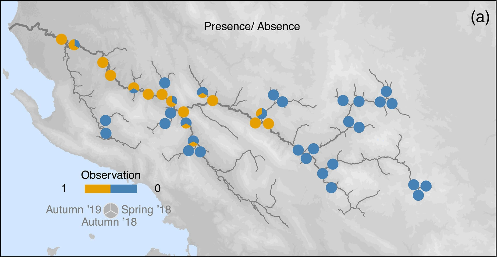
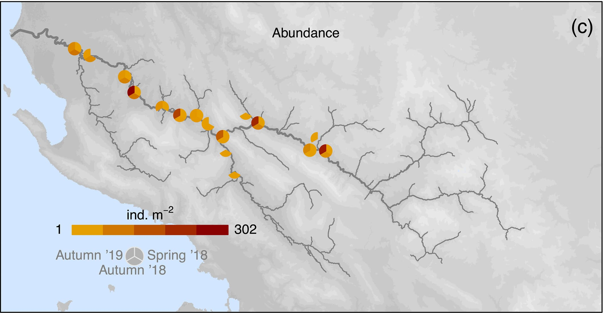

```{r setup, include=FALSE, results = "hide"}
# knitr::opts_chunk$set(echo = FALSE)
knitr::opts_chunk$set(fig.width=5.5, fig.height=5.5, collapse = TRUE, comment = "##", dev="png")

library(data.table)
library(ggplot2)
library(igraph)
library(ggnetwork)
library(rstan)
library(bayesplot)
library(lme4)
library(mvtnorm)
library(raster)
library(gstat)

options(mc.cores = parallel::detectCores())
rstan_options(auto_write = TRUE)

cols = scales::hue_pal()(4)

```

## Chapter 1: An abundance model for Prosopistoma

Indroducing *Prosopistoma peregrinum*

{width=30%} {width=30%}

Nearly extinct, known from only 3 rivers in Europe. 

**Question:** What habitat features are important for maintaining large populations?

## Prosopistoma abundance

**Question:** What habitat features are important for maintaining large populations?

::: {.columns}
:::: {.column}

{width=70%}

::::
:::: {.column}

{width=70%}
::::
:::

:::: {.small}
Source: [Martini et. al 2022. Insect Cons. Div.](https://resjournals.onlinelibrary.wiley.com/doi/full/10.1111/icad.12620)
::::


## Prosopistoma abundance

```{r proso_hist, echo = FALSE}

pdat = fread("../vu_advstats_students/data/prosopistoma_Data.csv")
pdat[[1]] = NULL
 colnames(pdat)[ncol(pdat)] = "proso_abun"

ggplot(pdat, aes(x = proso_abun)) + 
	geom_histogram(aes(y = after_stat(density), fill = season_3), alpha = 0.8, position = "stack", bins = 50) + 
	theme_minimal() + scale_fill_discrete("Season") + xlab(expression(italic(Prosipistoma)~~abundance))
```


## Proso species distribution model

**Easier question**: What determines *Prosopistoma* presence and absence?

We can build an **SDM** using a binomial presence-absence model

{width=70%}

## Proso species distribution model

::: {.columns}
:::: {.column}

```{stan proso_sdm, output.var = "proso_sdm", eval = FALSE}
data {
	int <lower = 1> n; // number of data points
	int <lower = 1> k; // number of variables
	int <lower = 0, upper = 1> pres_abs [n];
	matrix [n, k] X;
}
parameters {
	real a;
	vector [k] B;
}
transformed parameters {
	vector <lower = 0, upper = 1> [n] theta;
	prob_pres = inv_logit(a + X * B);
}
model {
	pres_abs ~ binomial(1, theta);
	a ~ normal(0, 10);
	B ~ normal(0, 5);
}

```


::::
:::: {.column}

```{r proso_sdm_graph, echo = FALSE, fig.width=8, warning = FALSE}
gr = graph_from_literal(pres_abs+-theta, theta+-B, theta+-a,
						B+-Bmu, B+-Bsig, a+-amu, a+-asig, theta+-X)
V(gr)$type = c(rep("stochastic", 4), rep("deterministic", 5)) 
V(gr)$source = c("known", rep("unknown", 3), rep("known", 5))
layout = rbind(died = c(0, 1), theta = c(0,0.67), B = c(0.25, 0.33),  a = c(-0.25, 0.33), bmu = c(0.15, 0),
	  bsig = c(0.35, 0), amu = c(-0.35, 0), asig = c(-0.15, 0), X = c(0.2, 0.9))
nt = ggnetwork(gr, layout=layout)
nlabs = c(expression(a[mu]), "a", expression(a[sigma]), expression(theta), expression(B[mu]), "X", "B", expression(B[sigma]), 
		  "pres_abs")


gr_sdm = ggplot(nt, aes(x = x, y = y, xend = xend, yend = yend)) + 
	geom_edges(colour="gray50", arrow=arrow(length = unit(6, "pt"), type = "closed")) + 
	theme_blank() + geom_nodes(aes(color=type, shape = source), size=4) + 
	geom_nodelabel(label = nlabs, nudge_x=-0.15, nudge_y=-0.05) +
	annotate(geom="label", x = 1.5, y = 0, label = "Hyperparameter layer") + 
	annotate(geom="label", x = 1.5, y = 0.5, label = "Parameter layer") + 
	annotate(geom="label", x = 1.5, y = 1, label = "Observation layer") + 
	xlim(-0.5, 1.7) + ggtitle("Unooled Intercepts")
gr_sdm
```

::::
:::

## Proso abundance

We can imagine a two-step process:

**Q1**: Is the site suitable?

$$ pres\_abs \sim \mathrm{Binomial}(\theta) $$

**Q2**: If suitable, how many Proso are there?

$$ count \sim \mathrm{Poisson}(\lambda) $$

**Problem:** An observed count of zero can be generated in two ways! (Binomial or Poisson)


## Proso abundance

**Problem:** An observed count of zero can be generated in two ways! (Binomial or Poisson)

We need the **addition rule** and the **product rule** from day 1!

### Product rule:

If $count > 0$, we know that the species is present (with probability $\theta$) **and** it has a poisson probability, so the total probability is $\theta \times \mathcal{P}(count | \lambda)$.

### Addition rule:

If $count = 0$, either the site is unsuitable (with probability $1-\theta$) **or** it is suitable (prob $\theta$) **and** it has a poisson count of zero.: $(1- \theta) + \theta \times \mathcal{P}(0 | \lambda)$


## Proso abundance

This is a **zero-inflated model**, a special case of a **finite mixture model**

$$
pr(count_i | \theta,\lambda) = 
\begin{cases} 
	(1 - \theta) + \theta \times \mathcal{P}(0 | \lambda) & & count_i = 0 \\
	\theta \times \mathcal{P}(count_i | \lambda) & & count_i > 0 \\
\end{cases}
$$

## Finite mixtures

More generally, if an observation $y_i$ comes from a mixture of $n$ distributions, each with parameters $\theta_j$ and with mixing proportion $\lambda_j$:

$$
	pr(y_i | \Theta) = \sum_{j=1}^n \lambda_j \mathcal{D}(y_i | \theta_j)
$$


## Finite mixtures

More generally, if an observation $y_i$ comes from a mixture of $n$ distributions, each with parameters $\theta_j$ and with mixing proportion $\lambda_j$...

We can of course fit a regression with a link function and covariates to each distribution!

$$
\begin{aligned}
	pr(y_i | \Theta) & = \sum_{j=1}^n \lambda_j \mathcal{D}(y_i | \eta_{ij}, \theta_j) \\
	\eta_{ij} & = \mathcal{f}_j^{-1}(a_j + \mathbf{X}_{ij}\mathbf{B}_j)
\end{aligned}
$$


## Fitting proso abundance

```{stan proso_fmm, output.var = "proso_fmm", cache = TRUE}
// file: proso_mixture.stan
data {
	// we split the dataset into zeros and not-zeros
	// we also allow two sets of covariates, one for presence-absence and one for nonzero counts
	int <lower = 0> n_zeros;
	int <lower = 0> n_counts;
	int <lower = 1> k_pa;
	int <lower = 1> k_pois;

	// four covariate matrices:
	// 		observed zeros, presence-absence process
	// 		observed nonzeros, presence-absence process
	// 		observed zeros, poisson (count) process
	// 		observed nonzeros, poisson process
	matrix [n_zeros, k_pa] X_zeros_pa; // binomial process, observed zeros
	matrix [n_counts, k_pa] X_count_pa; // binomial process, observed nonzeros
	matrix [n_zeros, k_pois] X_zeros_pois; // poisson process, observed zeros
	matrix [n_counts, k_pois] X_count_pois; // poisson process, observed zeros

	// the observed nonzero counts
	int <lower = 1> counts [n_counts];

	// prior hyperparams
	real a_pa_scale;
	real B_pa_scale;
	real a_pois_scale;
	real B_pois_scale;
}
parameters {
	// one set of linear parameters for determining the probability of presence
	real a_pa;
	vector [k_pa] B_pa;

	// a second set of parameters for determining the count if present
	real a_count;
	vector [k_pois] B_count;
}
transformed parameters {
	// first, we have a probability of presence and an expected count for each observed zero
	vector <lower = 0, upper = 1> [n_zeros] prob_pres_zeros;
	vector <lower = 0> [n_zeros] lam_zeros;

	// then we have the same for each observed (nonzero) count
	vector <lower = 0, upper = 1> [n_counts] prob_pres_counts;
	vector <lower = 0> [n_counts] lam_counts;
	
	prob_pres_zeros = inv_logit(a_pa + X_zeros_pa * B_pa);
	lam_zeros = exp(a_count + X_zeros_pois * B_count);

	prob_pres_counts = inv_logit(a_pa + X_count_pa * B_pa);
	lam_counts = exp(a_count + X_count_pois * B_count);
}
model {
	for(i in 1:n_zeros) {
		// on the probability scale, just to see
		// in the end we must work on the log scale, so it's a bit more complicated
		//      target *= (1 - prob_pres[i]) + prob_pres[i] * poisson_pmf(0 | lam_zeros[i]);

		// log_sum_exp performs the computation above, but keeping all values on the log scale
		// log_sum_exp(x1, x2) is equivalent to log(e^x1 + e^x2), but it never performs exponentiation
		// x1 and x2 are kept on the log scale, so we avoid numerical problems
		// see: https://mc-stan.org/docs/stan-users-guide/log-sum-of-exponentials.html
		target += log_sum_exp(
			// first term, the binomial term, now on the log scale
			log(1 - prob_pres_zeros[i]),
			// second term, the poisson term, on the log scale
			log(prob_pres_zeros[i]) + poisson_lpmf(0 | lam_zeros[i])
		);
	}

	// for the nonzero counts, we use a poisson likelihood as usual, with the added complication
	// that we must account for the probability of presence!
	for(i in 1:n_counts) {
		target += log(prob_pres_counts[i]) + poisson_lpmf(counts[i] | lam_counts[i]);
	}


	a_pa ~ normal(0, a_pa_scale);
	B_pa ~ normal(0, B_pa_scale);

	a_count ~ normal(0, a_pois_scale);
	B_count ~ normal(0, B_pois_scale);
}
generated quantities {
	// capture model deviance and lppd
	real deviance = 0;
	vector [n_zeros + n_counts] lppd;

	// simulate to get the PPD
	int ppd_counts [n_zeros + n_counts];

	// first simulate for all observed zeros
	for(i in 1:n_zeros) {
		// first term simulates the presence-absence part
		// then we multiply by a simulated poisson
		ppd_counts[i] = binomial_rng(1, prob_pres_zeros[i]) * poisson_rng(lam_zeros[i]);
		lppd[i] = log_sum_exp(log(1 - prob_pres_zeros[i]), 
			log(prob_pres_zeros[i]) + poisson_lpmf(0 | lam_zeros[i]));
		deviance += lppd[i];
	}

	// next simulate all observed nonzeros
	for(j in 1:n_counts) {
		ppd_counts[j + n_zeros] = binomial_rng(1, prob_pres_counts[j]) * poisson_rng(lam_counts[j]);
		lppd[j + n_zeros] = log(prob_pres_counts[j]) + poisson_lpmf(counts[j] | lam_counts[j]);
		deviance += lppd[j + n_zeros];
	}
	deviance *= -2;
}

```

## Fitting proso abundance

### Specific hypotheses:

1. Habitat suitability (presence-absence) depends on river size, water temperature, and sediment deposition.
2. These covariates matter for abundance as well, but competition is also important.

```{r proso_fmm_fit, echo = FALSE, cache = TRUE}
X = cbind(log(pdat$discharge), scale(pdat$mean_sediment), 
	scale(pdat$mean_temperature), scale(pdat$ntaxa))
X = cbind(X, X^2)
colnames(X) = paste(c("log_Q", "sediment", "temperature", "ntaxa"), rep(c("", "^2"), each = 4), sep="")

i = which(pdat$proso_abun == 0)
j = which(pdat$proso_abun != 0)
proso_zeros = pdat[i]
proso_counts = pdat[j]

k_pa = c(1:3)
k_pois = 1:8

stan_data_fmm = list(
	n_zeros = nrow(proso_zeros),
	n_counts = nrow(proso_counts),
	counts = proso_counts$proso_abun,
	k_pa = length(k_pa),
	k_pois = length(k_pois),
	X_zeros_pa = X[i, k_pa],
	X_count_pa = X[j, k_pa],
	X_zeros_pois = X[i, k_pois],
	X_count_pois = X[j, k_pois],
	a_pa_scale = 20,
	B_pa_scale = 10,
	a_pois_scale = 10,
	B_pois_scale = 5
)

ifun = function() {
	list(a_pa = runif(1, -2, 2), B_pa = runif(length(k_pa), -2, 2), a_count = runif(1, -2, 2),
		B_count = c(runif(4, -2, 2), runif(4, -2, 0)))
}

fit_fmm = sampling(proso_fmm, data = stan_data_fmm, init = ifun, chains = 4, iter = 5000, refresh = 0,
	open_progress = FALSE)

samples = as.matrix(fit_fmm, pars = c("a_pa", "B_pa", "a_count", "B_count"))

```

## Fitting proso abundance

### Specific hypotheses:

1. Habitat suitability (presence-absence) depends on river size, water temperature, and sediment deposition.
2. These covariates matter for abundance as well, but competition is also important.

```{r proso_fmm_plot, echo = FALSE, cache = TRUE, fig.height = 9, fig.width=15}
colnames(samples) = c("a_pa", "logQ_pa", "sediment_pa", "temperature_pa", "a_pois", 
					  "logQ_pois", "sediment_pois", "temperature_pois", "nT_pois",
					  "logQ_pois^2", "sediment_pois^2", "temperature_pois^2", "nT_pois^2")
int_plot = mcmc_intervals(samples, point_size = 1)


# response curves
pldat = data.table(
	log_Q = seq(-1, 4, length.out = 200),
	sediment = seq(-2, 5, length.out = 200),
	temperature = seq(-3, 2.5, length.out = 200),
	ntaxa = seq(-1, 7, length.out = 200)
)
pldat[["log_Q^2"]] = pldat[["log_Q"]]^2
pldat[["sediment^2"]] = pldat[["sediment"]]^2
pldat[["temperature^2"]] = pldat[["temperature"]]^2
pldat[["ntaxa^2"]] = pldat[["ntaxa"]]^2

samps = as.matrix(fit_fmm, pars = c("a_pa", "B_pa", "a_count", "B_count"))
ypr = apply(samps, 1, \(x) plogis(x["a_pa"] + x["B_pa[1]"] * pldat$log_Q))
ypr = t(apply(ypr, 1, quantile, c(0.5, 0.05, 0.95)))
pldat$y_pa_log_Q = ypr[,1]
pldat$y_pa_log_Q_l = ypr[,2]
pldat$y_pa_log_Q_u = ypr[,3]

ypr = apply(samps, 1, \(x) plogis(x["a_pa"] + x["B_pa[1]"] * 2 + x["B_pa[2]"] * pldat$sediment))
ypr = t(apply(ypr, 1, quantile, c(0.5, 0.05, 0.95)))
pldat$y_pa_sediment = ypr[,1]
pldat$y_pa_sediment_l = ypr[,2]
pldat$y_pa_sediment_u = ypr[,3]

ypr = apply(samps, 1, \(x) plogis(x["a_pa"] + x["B_pa[1]"] * 2 + x["B_pa[3]"] * pldat$temperature))
ypr = t(apply(ypr, 1, quantile, c(0.5, 0.05, 0.95)))
pldat$y_pa_temperature = ypr[,1]
pldat$y_pa_temperature_l = ypr[,2]
pldat$y_pa_temperature_u = ypr[,3]

pl_pa_Q = ggplot(pldat) + geom_line(aes(x = log_Q, y = y_pa_log_Q), col = cols[1]) + 
	geom_ribbon(aes(x = log_Q, ymin = y_pa_log_Q_l, ymax = y_pa_log_Q_u), 
		fill = cols[1], alpha = 0.3, col = cols[1]) + theme_minimal() + 
	xlab("log Discharge") + ylab("Probability of presence") + ylim(0, 1) +
	annotate(geom = "text", x = -1, y = 1, label = "Temperature = 0, Sediment = 0", hjust = 0)

pl_pa_sed = ggplot(pldat) + geom_line(aes(x = sediment, y = y_pa_sediment), col = cols[2]) + 
	geom_ribbon(aes(x = sediment, ymin = y_pa_sediment_l, ymax = y_pa_sediment_u), 
		fill = cols[2], alpha = 0.3, col = cols[2]) + theme_minimal() + 
	xlab("Sediment") + ylab("Probability of presence") + ylim(0, 1) +
	annotate(geom = "text", x = -2, y = 1, label = "Temperature = 0, log Discharge = 2", hjust = 0)

pl_pa_temp = ggplot(pldat) + geom_line(aes(x = temperature, y = y_pa_temperature), col = cols[3]) + 
	geom_ribbon(aes(x = temperature, ymin = y_pa_temperature_l, ymax = y_pa_temperature_u), 
		fill = cols[3], alpha = 0.3, col = cols[3]) + theme_minimal() + 
	xlab("Temperature") + ylab("Probability of presence") + ylim(0, 1) + 
	annotate(geom = "text", x = -3, y = 1, label = "Sediment = 0, log Discharge = 2", hjust = 0)


qtest = 2
ypr = apply(samps, 1, \(x) exp(x["a_count"] + x["B_count[1]"] * pldat$log_Q + 
	x["B_count[5]"] * pldat[["log_Q^2"]]))
ypr = t(apply(ypr, 1, quantile, c(0.5, 0.05, 0.95)))
pldat$y_count_log_Q = ypr[,1]
pldat$y_count_log_Q_l = ypr[,2]
pldat$y_count_log_Q_u = ypr[,3]

ypr = apply(samps, 1, \(x) exp(x["a_count"] + x["B_count[1]"] * qtest + 
	x["B_count[5]"] * qtest^2 + x["B_count[2]"] * pldat$sediment + 
	x["B_count[6]"] * pldat[["sediment^2"]]))
ypr = t(apply(ypr, 1, quantile, c(0.5, 0.05, 0.95)))
pldat$y_count_sediment = ypr[,1]
pldat$y_count_sediment_l = ypr[,2]
pldat$y_count_sediment_u = ypr[,3]

ypr = apply(samps, 1, \(x) exp(x["a_count"] + x["B_count[1]"] * qtest + 
	x["B_count[5]"] * qtest^2 + x["B_count[3]"] * pldat$temperature + 
	x["B_count[7]"] * pldat[["temperature^2"]]))
ypr = t(apply(ypr, 1, quantile, c(0.5, 0.05, 0.95)))
pldat$y_count_temperature = ypr[,1]
pldat$y_count_temperature_l = ypr[,2]
pldat$y_count_temperature_u = ypr[,3]

ypr = apply(samps, 1, \(x) exp(x["a_count"] + x["B_count[1]"] * qtest + 
	x["B_count[5]"] * qtest^2 + x["B_count[4]"] * pldat$ntaxa + 
	x["B_count[8]"] * pldat[["ntaxa^2"]]))
ypr = t(apply(ypr, 1, quantile, c(0.5, 0.05, 0.95)))
pldat$y_count_ntaxa = ypr[,1]
pldat$y_count_ntaxa_l = ypr[,2]
pldat$y_count_ntaxa_u = ypr[,3]

pl_count_Q = ggplot(pldat) + geom_line(aes(x = log_Q, y = y_count_log_Q), col = cols[1]) + 
	geom_ribbon(aes(x = log_Q, ymin = y_count_log_Q_l, ymax = y_count_log_Q_u), 
		fill = cols[1], alpha = 0.3, col = cols[1]) + theme_minimal() + 
	xlab("log Discharge") + ylab("Prosopistoma abundance") + ylim(0, 325) +
	annotate(geom = "text", x = -1, y = 300, label = "Temperature = Sediment = ntaxa = 0,", hjust = 0)

pl_count_sed = ggplot(pldat) + geom_line(aes(x = sediment, y = y_count_sediment), col = cols[2]) + 
	geom_ribbon(aes(x = sediment, ymin = y_count_sediment_l, ymax = y_count_sediment_u), 
		fill = cols[2], alpha = 0.3, col = cols[2]) + theme_minimal() + 
	xlab("Sediment") + ylab("Prosopistoma abundance") + ylim(0, 325) +
	annotate(geom = "text", x = -2, y = 300, label = "Temperature = ntaxa = 0, log Discharge = 2", hjust = 0)

pl_count_temp = ggplot(pldat) + geom_line(aes(x = temperature, y = y_count_temperature), col = cols[3]) + 
	geom_ribbon(aes(x = temperature, ymin = y_count_temperature_l, ymax = y_count_temperature_u), 
		fill = cols[3], alpha = 0.3, col = cols[3]) + theme_minimal() + 
	xlab("Temperature") + ylab("Prosopistoma abundance") + ylim(0, 325) +
	annotate(geom = "text", x = -3, y = 300, label = "Sediment = ntaxa = 0, log Discharge = 2", hjust = 0)

pl_count_ntaxa = ggplot(pldat) + geom_line(aes(x = ntaxa, y = y_count_ntaxa), col = cols[4]) + 
	geom_ribbon(aes(x = ntaxa, ymin = y_count_ntaxa_l, ymax = y_count_ntaxa_u), 
		fill = cols[4], alpha = 0.3, col = cols[4]) + theme_minimal() + 
	xlab("Abundance of other taxa") + ylab("Prosopistoma abundance") + ylim(0, 325) +
	annotate(geom = "text", x = -3, y = 300, label = "Temperature = Sediment = 0, log Discharge = 2", hjust = 0)


gridExtra::grid.arrange(int_plot, pl_pa_Q, pl_pa_sed, pl_pa_temp, pl_count_ntaxa, 
						pl_count_Q, pl_count_sed, pl_count_temp, nrow = 2)
```


## Response surfaces


```{r proso_resp_surface, echo = FALSE, cache = TRUE, fig.height = 7, fig.width=15}

## Last fit a response surface for the two variables that seem the biggest
pldat2 = expand.grid(	log_Q = seq(-1, 5, length.out = 100), 
	temperature = seq(-3, 2.5, length.out = 100))
pldat2[["log_Q^2"]] = pldat2$log_Q^2
pldat2[["temperature^2"]] = pldat2$temperature^2

ypr = apply(samps, 1, \(x) {
		pr = plogis(x["a_pa"] + x["B_pa[1]"] * pldat2$log_Q + x["B_pa[2]"] * 1 + 
			x["B_pa[3]"] * pldat2$temperature)
		pr * exp(
			x["a_count"] + x["B_count[1]"] * pldat2[["log_Q"]] + x["B_count[5]"] * pldat2[["log_Q^2"]] +
			x["B_count[2]"] * 1 + x["B_count[6]"] * 1^2 + 
			x["B_count[3]"] * pldat2[["temperature"]] + x["B_count[7]"] * pldat2[["temperature^2"]] +
			x["B_count[4]"] * 0.5 + x["B_count[8]"] * 0.5^2)
	})
pldat2$y = apply(ypr, 1, mean)
pldat2$y_sd = apply(ypr, 1, sd)

ptdat = data.frame(y = stan_data_fmm$counts, Q = stan_data_fmm$X_count_pois[,"log_Q"], 
	temp = stan_data_fmm$X_count_pois[,"temperature"])
ptdat = rbind(ptdat, data.frame(y = rep(0.01, stan_data_fmm$n_zeros), Q = stan_data_fmm$X_zeros_pois[,"log_Q"], 
	temp = stan_data_fmm$X_zeros_pois[,"temperature"]))
resp_surface = ggplot(pldat2) + geom_tile(aes(x = log_Q, y = temperature, fill = y)) + 
	geom_point(data = ptdat, aes(x = Q, y = temp, size = y), col = '#00b8e6') + 
	scale_fill_viridis_c("Predicted Abundance", option = "magma") +
	guides(size=guide_legend(title="Observed Abundance")) + xlab("Log Discharge") + ylab("Temperature")

resp_surface_err = ggplot(pldat2) + geom_tile(aes(x = log_Q, y = temperature, fill = y_sd)) + 
	scico::scale_fill_scico("Predicted Abundance Standard Error", palette = "davos") +
	#scale_fill_viridis_c("Predicted Abundance Standard Error", option = "rocket") +
	xlab("Log Discharge") + ylab("Temperature")

gridExtra::grid.arrange(resp_surface, resp_surface_err, nrow = 1)

```

## Capturing zero inflation

```{r proso_posterior_hist, echo = FALSE, cache = TRUE, fig.height = 7, fig.width=7}
ppd = as.matrix(fit_fmm, pars = "ppd_counts")
ppd = apply(ppd, 2, median)
histdat = data.frame(abundance = c(pdat$proso_abun, ppd), 
	type = c(rep("Observed", nrow(pdat)), rep("Predicted", length(ppd))))
ggplot(data = histdat) + 
	geom_histogram(aes(x = abundance, fill = type), position = "identity", alpha = 0.3, bins=50)

```


## Chapter 2: Lost in space

### The problem of nonindependence

* Recall that all of our linear models have an **independence assumption**

$$
\begin{aligned}
	\mathrm{L}[\mathbb{E}(y)] & = \alpha + \beta{\mathbf{X}} \\
	\theta & = \mathcal{f}[\mathbb{E}(y)] \\
	y & \sim \mathcal{D}(\theta) \\
	\\
	\mathrm{pr}(y_i | \color{red}{y_{-i}}, \alpha, \beta, \mathbf{X}) & \equiv 
	\mathrm{pr}(y_i | \alpha, \beta, \mathbf{X}) 
\end{aligned}
$$

* This assumption is what allows us to compute the log-likelihood of all the data as the sum of the log-likelihoods of individual data points


## Nonidependence consequences

* We **must** incorporate nonindependence in the model
   - Potentially biased parameter estimates
   - Standard errors and *p*-values will be too low
   - Potential for misspecification (important effects will appear unimportant, unimportant effects appear important)
   

## Reducing nonindependence
> - Add important *x*-variables and remove unimportant ones (but how can we know?)
> - Incorporate known structure into the model using hierarchical terms
> - Model covariance directly, estimating it from the data


## The random intercepts model

::: {.columns}
:::: {.column}

* Mixed models allow us to relax the conditional independence
* Individual observations covary by means of shared group-level parameters

::::
:::: {.column}


```{r penguin_glm, fig.height = 5, fig.width = 5, echo=FALSE, warning = FALSE}
penguins = as.data.frame(palmerpenguins::penguins)

mod = glm(bill_length_mm ~ flipper_length_mm, data = penguins)
ggplot(penguins, aes(x = flipper_length_mm, y = bill_length_mm, colour=species)) + geom_point() + 
	geom_abline(intercept = coef(mod)[1], slope = coef(mod)[2], linewidth=1.5, colour='black') + 
	scale_colour_manual(values=cols) + theme_minimal()
```

::::
:::


## The random intercepts model

::: {.columns}
:::: {.column}

* Mixed models allow us to relax the conditional independence
* Individual observations covary by means of shared group-level parameters

When observation $i$ is in group $j$

$$
\begin{aligned}
\mathbb{E}(y_i) & = \alpha + \gamma_j + \beta X \\
y & \sim \mathcal{N}\left (\mathbb{E} \left (y \right ), \sigma \right) \\
\gamma & \sim \mathcal{N}(0, \sigma_\gamma)
\end{aligned}
$$

$\gamma$ models an **offset** from the global intercept (hence prior mean of 0)

::::
:::: {.column}


```{r penguin_glmm, fig.height = 5, fig.width = 5, echo=FALSE, warning = FALSE}
mod = lmer(bill_length_mm ~ flipper_length_mm + (1|species), data = penguins)
a_mm = coef(mod)$species[,1]
b_mm = coef(mod)$species[1,2]
ggplot(penguins, aes(x = flipper_length_mm, y = bill_length_mm, colour=species)) + geom_point() + 
	geom_segment(aes(x = 170, xend = 210, y = a_mm[1] + b_mm*170, yend = a_mm[1] + b_mm*210), linewidth=0.8, colour=cols[1]) + 
	geom_segment(aes(x = 175, xend = 215, y = a_mm[2] + b_mm*175, yend = a_mm[2] + b_mm*215), linewidth=0.8, colour=cols[2]) + 
	geom_segment(aes(x = 200, xend = 230, y = a_mm[3] + b_mm*200, yend = a_mm[3] + b_mm*230), linewidth=0.8, colour=cols[3]) + 
	scale_colour_manual(values=cols) + theme_minimal() + xlab("Flipper Length (mm)") + ylab("Bill Length (mm)")
```

::::
:::


## Group membership via spatial neighbours

::: {.columns}
:::: {.column}

* Here we have a strong spatial pattern in lip cancer incidence in Scotland (1975-1980)

::::
:::: {.column}


```{r getscotlip, include=FALSE, message = FALSE}
library(sf)
scotlip = st_read("../vu_advstats_students/data/scotlip.gpkg")
scotlip_nb = readRDS("../vu_advstats_students/data/scotlip_neighbours.rds")
```


```{r plot_scotland, echo=FALSE, message=FALSE, warning=FALSE}
pl_scot = ggplot(scotlip, aes(fill = CANCER/(POP/1000))) + geom_sf(color='white') + 
	scico::scale_fill_scico(palette = "bilbao", direction = -1) + 
	theme_minimal() + 
	theme(axis.line=element_blank(), axis.text.x=element_blank(), axis.text.y=element_blank(),
		  axis.ticks=element_blank(), axis.title.x=element_blank(), axis.title.y=element_blank(),
		  panel.background=element_blank(), panel.border=element_blank(), 
		  panel.grid.major=element_blank(),
	      panel.grid.minor=element_blank(), plot.background=element_blank()) + 
	labs(fill="Lip Cancer Incidence\n(cases/1000 people)")
pl_scot

```


::::
:::


## Group membership via spatial neighbours

::: {.columns}
:::: {.column}

* Here we have a strong spatial pattern in lip cancer incidence in Scotland (1975-1980)
* As with the US cancer dataset, we can use a Poisson model, controlling for population size ($E$)

::::
:::: {.column}

```{r plot_scotland2, echo=FALSE, message=FALSE, warning=FALSE}
pl_scot
```

$$
\begin{aligned}
	y & \sim \mathcal{P}(\lambda E) \\
\end{aligned}
$$

::::
:::


## Group membership via spatial neighbours

::: {.columns}
:::: {.column}

* Here we have a strong spatial pattern in lip cancer incidence in Scotland (1975-1980)
* As with the US cancer dataset, we can use a Poisson model, controlling for population size ($E$)
* This time, we instead of a global random effect, we add a local effect:
	- Each district has a unique group, consisting of itself and it's $\nu$ neighbours

::::
:::: {.column}

```{r plot_scot_nb, echo=FALSE, message=FALSE, warning=FALSE}
j = which.max(scotlip$CANCER/scotlip$POP)
k = scotlip_nb[scotlip_nb[,1] == j, 2]
scotlip$skye_nb = factor("Not neighbours", levels = c(scotlip$NAME[j], "Neighbours", "Not neighbours"))
scotlip$skye_nb[k] = "Neighbours"
scotlip$skye_nb[j] = scotlip$NAME[j]

pl_scot_nb = ggplot(scotlip, aes(fill = skye_nb)) + geom_sf(color='white') + 
	scale_fill_manual(values = c(scales::hue_pal()(2), "#cccccc")) + 
	theme_minimal() + 
	theme(axis.line=element_blank(), axis.text.x=element_blank(), axis.text.y=element_blank(),
		  axis.ticks=element_blank(), axis.title.x=element_blank(), axis.title.y=element_blank(),
		  panel.background=element_blank(), panel.border=element_blank(), 
		  panel.grid.major=element_blank(),
	      panel.grid.minor=element_blank(), plot.background=element_blank()) + 
	labs(fill="Sky-Lochalsh Neighbourhood")
pl_scot_nb

```

$$
\begin{aligned}
	y & \sim \mathcal{P}(\lambda E) \\
	\lambda_i & = \frac{\sum_{j=1}^{\nu_i} \lambda_j}{\nu_i} \\
\end{aligned}
$$

::::
:::


## Group membership via spatial neighbours

::: {.columns}
:::: {.column}

* Here we have a strong spatial pattern in lip cancer incidence in Scotland (1975-1980)
* As with the US cancer dataset, we can use a Poisson model, controlling for population size ($E$)
* This time, we instead of a global random effect, we add a local effect:
	- Each district has a unique group, consisting of itself and it's $\nu$ neighbours
* We can also add **unstructured** effects

**Hypothesis**: Working outdoors (AFF: agriculture, forestry, and fishing) leads to lip cancer.

We need to account for space, or we might be wrong about AFF!

::::
:::: {.column}

```{r plot_scot_aff, echo=FALSE, message=FALSE, warning=FALSE}
pl_scot_aff = ggplot(scotlip, aes(fill = AFF)) + geom_sf(color='white') + 
	scale_fill_viridis_c() + 
	theme_minimal() + 
	theme(axis.line=element_blank(), axis.text.x=element_blank(), axis.text.y=element_blank(),
		  axis.ticks=element_blank(), axis.title.x=element_blank(), axis.title.y=element_blank(),
		  panel.background=element_blank(), panel.border=element_blank(), 
		  panel.grid.major=element_blank(),
	      panel.grid.minor=element_blank(), plot.background=element_blank()) + 
	labs(fill="% of population engaged in AFF")
pl_scot_aff

```

$$
\begin{aligned}
	y & \sim \mathcal{P}(\lambda E) \\
	\lambda_i & = \frac{\sum_{j=1}^{\nu_i} \lambda_j}{\nu_i} \\
\end{aligned}
$$

::::
:::


## Group membership via spatial neighbours

::: {.columns}
:::: {.column}

* Here we have a strong spatial pattern in lip cancer incidence in Scotland (1975-1980)
* As with the US cancer dataset, we can use a Poisson model, controlling for population size ($E$)
* This time, we instead of a global random effect, we add a local effect:
	- Each district has a unique group, consisting of itself and it's $\nu$ neighbours
* We can also add **unstructured** effects
* Here we use an formulation for **spatial random effects**
	- global intercept $a$
	- regression term $\mathbf{X}\mathbf{B}$
	- spatial random effect $\gamma$ which is an **offset** from the global intercept

::::
:::: {.column}

```{r plot_scot_aff2, echo=FALSE, message=FALSE, warning=FALSE}
pl_scot_aff

```

$$
\begin{aligned}
	y & \sim \mathcal{P}(\lambda E) \\
	\log \lambda_i & = a  + \mathbf{X}\mathbf{B} + \gamma \\
	\gamma & \sim \mathcal{N}(\mu_\gamma, \sigma_\gamma) \\
	\mu_{\gamma,i} & = \frac{\sum_{j=1}^nw_{i,j}\gamma_j}{\nu_i}
\end{aligned}
$$

::::
:::


## Group membership via spatial neighbours

::: {.columns}
:::: {.column}

* Here we have a strong spatial pattern in lip cancer incidence in Scotland (1975-1980)
* As with the US cancer dataset, we can use a Poisson model, controlling for population size ($E$)
* This time, we instead of a global random effect, we add a local effect:
	- Each district has a unique group, consisting of itself and it's $\nu$ neighbours
* We can also add **unstructured** effects
* Here we use an formulation for **spatial random effects**
	- Global intercept $a$
	- Regression term $\mathbf{X}\mathbf{B}$
	- Spatial random effect $\gamma$ which is an **offset** from the global intercept 

::::
:::: {.column}

```{r scotlip_graph, echo=FALSE, message=FALSE, warning=FALSE}

gr = graph_from_literal(y+-lambda, y+-E, lambda+-a, lambda+-B, lambda+-gamma, lambda+-X,
						a+-amu, a+-asig, B+-Bmu, B+-Bsig, gamma+-mu_gamma, gamma+-sig_gamma,
						sig_gamma+-mu_sig_gamma, sig_gamma+-sig_sig_gamma, mu_gamma+-gamma)

V(gr)$type = c("stochastic", rep("deterministic", 2), rep("stochastic", 3), rep("deterministic", 6), 
			   rep("stochastic", 1), rep("deterministic", 2))
V(gr)$source = c("known", "unknown", "known", rep("unknown", 3), rep("known", 5), 
				 rep("unknown", 2), rep("known", 2))
layout = rbind(y = c(0, 1), lambda = c(0, 0.75), E = c(-0.2, 0.95), a = c(-0.4, 0.5), B = c(0, 0.5),
			   gamma = c(0.4, 0.5), X = c(0.2, 0.95), amu = c(-0.5, 0.25), asig = c(-0.3, 0.25), 
			   Bmu = c(-0.1, 0.25), Bsig = c(0.1, 0.25), mu_gamma = c(0.3, 0.25),  sig_gamma = c(0.5, 0.25), 
			   mu_sig_gamma = c(0.45, 0), sig_sig_gamma = c(0.55, 0))
nt = ggnetwork(gr, layout=layout)


nlabs = c(expression(mu[a]), "a", expression(sigma[a]), "E", expression(mu[B]), "B", expression(lambda),
				expression(sigma[B]), "X", expression(mu[gamma]), expression(gamma), expression(mu[sigma[gamma]]),
				expression(sigma[gamma]), expression(sigma[sigma[gamma]]), "y")

grpl_lip = ggplot(nt, aes(x = x, y = y, xend = xend, yend = yend)) + 
	geom_edges(colour="gray50", arrow=arrow(length = unit(6, "pt"), type = "closed"), curvature = 0.1) + 
	theme_blank() + geom_nodes(aes(color=type, shape = source), size=6) + 
	geom_nodelabel(label = nlabs, fontface = "bold", nudge_x=-0.06, nudge_y = 0.05)
	# geom_nodelabel(aes(label = name), fontface = "bold", nudge_x=-0.1, nudge_y=0.05)
   # annotate(geom="label", x = 1.4, y = 0, label = "Hyperparameter layer") + 
   # annotate(geom="label", x = 1.4, y = 0.5, label = "Parameter layer") + 
   # annotate(geom="label", x = 1.4, y = 0.95, label = "Observation layer") + 
   # xlim(-0.5, 1.6) + ggtitle("Complete Pooling")
grpl_lip

```


::::
:::


## Coding our CAR


```{stan stan_cancer_car, output.var = "cancer_car", cache = TRUE}
data {
	int <lower = 1> n; // total number of districts, one data point per district
	int <lower = 1> k; // number of regression variables
	
	// spatial neighbourhood data
	// this is a sparse array
	// the district ID in column one is adjacent to column 2
	int <lower = 1> n_nb; // number of adjacencies
	int <lower = 1, upper = n> neighbours [n_nb, 2];

	// regression data
	int <lower = 0> deaths [n];
	vector <lower = 0> [n] exposure;
	matrix [n,k] X;
	
	// prior hyperparams
	real <lower=0> a_sig;
	real <lower=0> B_sig;
	
	// controls the strength of the spatial effect
	real <lower = 0> gamma_scale_sig;
}
transformed data {
	vector [n] nu = rep_vector(0, n); // number of neighbors per region
	for(i in 1:n_nb)
		nu[neighbours[i,1]] += 1;
	
}
parameters {
	// regression params
	real a;
	vector [k] B;

	// latent variable for spatial random effect
	real gamma_scale;
	vector [n] gamma;
}
transformed parameters {
	vector [n] gamma_expectation = rep_vector(0, n);
	vector <lower = 0> [n] lambda;
	
	for(i in 1:n_nb)
		gamma_expectation[neighbours[i,1]] += gamma[neighbours[i,2]];
	for(i in 1:n) {
		if(nu[i] > 0)
			gamma_expectation[i] = gamma_expectation[i] / nu[i];
	}
	lambda = exp(a + gamma + X*B);
}
model {
	deaths ~ poisson(exposure .* lambda);
	gamma ~ normal(gamma_expectation, gamma_scale);
	gamma_scale ~ normal(0, gamma_scale_sig);
	a ~ normal(0, a_sig);
	B ~ normal(0, B_sig);
}
generated quantities {
	int ppd [n];
	ppd = poisson_rng(exposure .* lambda);
}
```


## Fitting the model

```{r load_scotlip, eval = FALSE}
library(sf)
library(rstan)
scotlip = st_read("../vu_advstats_students/data/scotlip.gpkg")
scotlip_nb = readRDS("../vu_advstats_students/data/scotlip_neighbours.rds")

## read neighbours
stan_cancer_car = stan_model("vu_advstats_students/stan/scotlip.stan")
```

``` {r fit_car, message = FALSE, cache = TRUE, warning = FALSE}
X = matrix(scotlip$AFF, ncol = 1)

standata = list(	
	n = nrow(scotlip),
	k = ncol(X),
	
	n_nb = nrow(scotlip_nb),
	neighbours = scotlip_nb,
	deaths = scotlip$CANCER,
	exposure = scotlip$POP/1000,
	X = X,
	a_sig = 10,
	B_sig = 5,
	gamma_scale_sig = 10
)


# we need inits to keep the poisson function small
initfun = function() list(a = runif(1, -3,0), B = runif(ncol(X), -3, 0), gamma = runif(nrow(scotlip), -0.1, 0.1))

fit_car = sampling(cancer_car, data = standata, iter = 50000, chains = 4, control = list(max_treedepth = 20),
				   init = initfun, refresh = 0, open_progress = FALSE)

```


## Examining the model

::: {.columns}
:::: {.column}

* Spatial effects are not identifiable!
* Non-structured effects are still clear
	- B = 0.04: ~ 4 extra cancer deaths / 100k people for every 1% increase in outdoor employment

::::
:::: {.column}

``` {r intervals, echo = FALSE, cache = TRUE}
samps = as.matrix(fit_car, pars = c("a", "B", "gamma"))
mcmc_intervals(samps, point_size = 1)
```
::::
:::


## Examining the model

::: {.columns}
:::: {.column}

* Spatial effects are not identifiable!
* Non-structured effects are still clear
	- B = 0.04: ~ 4 extra cancer deaths / 100k people for every 1% increase in outdoor employment
* Prediction accuracy is good!

::::
:::: {.column}

``` {r car_fit, echo = FALSE, cache = TRUE}
lam = as.matrix(fit_car, pars = c("lambda"))
lam = data.frame(predicted = apply(lam, 2, median), lower = apply(lam, 2, quantile, 0.05), 
				 upper = apply(lam, 2, quantile, 0.95), observed = scotlip$CANCER / (scotlip$POP/1000))
ggplot(lam) + geom_errorbar(aes(x = observed, ymin = lower, ymax = upper)) + 
	geom_point(aes(x = observed, y = predicted)) + geom_abline(slope = 1, intercept = 0, lty=2) + 
	theme_minimal() + xlab("Observed cancer death rate") + ylab("Predicted cancer death rate")

```
::::
:::


## Examining the model

::: {.columns}
:::: {.column}

* Spatial effects are not identifiable!
* Non-structured effects are still clear
	- B = 0.04: ~ 4 extra cancer deaths / 100k people for every 1% increase in outdoor employment
* Prediction accuracy is good!
* We can map predicted cancer rates

::::
:::: {.column}

``` {r car_spatial_pred, echo = FALSE}
scotlip$predicted = lam$predicted
pl_scot_pr_lam = ggplot(scotlip, aes(fill = predicted)) + geom_sf(color='white') + 
	scico::scale_fill_scico(palette = "bilbao", direction = -1, limits = c(0, 0.32)) + 
	theme_minimal() + 
	theme(axis.line=element_blank(), axis.text.x=element_blank(), axis.text.y=element_blank(),
		  axis.ticks=element_blank(), axis.title.x=element_blank(), axis.title.y=element_blank(),
		  panel.background=element_blank(), panel.border=element_blank(), 
		  panel.grid.major=element_blank(),
	      panel.grid.minor=element_blank(), plot.background=element_blank()) + 
	labs(fill="Predicted incidence\n(cases/1000)")
gridExtra::grid.arrange(pl_scot_pr_lam, pl_scot, ncol = 1)

```
::::
:::


## Examining the model

::: {.columns}
:::: {.column}

* Spatial effects are not identifiable!
* Non-structured effects are still clear
	- B = 0.04: ~ 4 extra cancer deaths / 100k people for every 1% increase in outdoor employment
* Prediction accuracy is good!
* We can map predicted cancer rates
* We can also map the median (but unidentifiable!) spatial random effect and the detrended residuals

::::
:::: {.column}

``` {r car_spatial_resid, echo = FALSE, cache = TRUE}
gamma = as.matrix(fit_car, pars = "gamma")
scotlip$gamma = apply(gamma, 2, median)
resid = as.matrix(fit_car, pars = "lambda")
scotlip$resid =  (scotlip$CANCER / (scotlip$POP/1000)) - apply(resid, 2, median)
pl_scot_gam = ggplot(scotlip, aes(fill = gamma)) + geom_sf(color='white') + 
	scale_fill_viridis_c() + 
	theme_minimal() + 
	theme(axis.line=element_blank(), axis.text.x=element_blank(), axis.text.y=element_blank(),
		  axis.ticks=element_blank(), axis.title.x=element_blank(), axis.title.y=element_blank(),
		  panel.background=element_blank(), panel.border=element_blank(), 
		  panel.grid.major=element_blank(),
	      panel.grid.minor=element_blank(), plot.background=element_blank()) + 
	labs(fill="Spatial Random Effect")

pl_scot_resid = ggplot(scotlip, aes(fill = resid)) + geom_sf(color='white') + 
	scico::scale_fill_scico(palette = "vik", midpoint = 0) + 
	theme_minimal() + 
	theme(axis.line=element_blank(), axis.text.x=element_blank(), axis.text.y=element_blank(),
		  axis.ticks=element_blank(), axis.title.x=element_blank(), axis.title.y=element_blank(),
		  panel.background=element_blank(), panel.border=element_blank(), 
		  panel.grid.major=element_blank(),
	      panel.grid.minor=element_blank(), plot.background=element_blank()) + 
	labs(fill="Spatially Detrended Residuals")

gridExtra::grid.arrange(pl_scot_gam, pl_scot_resid, ncol = 1)

```
::::
:::


## Continuous spatial models

::: {.columns}
:::: {.column}

* With point data, all points are neighbours, but some neighbours are more important than others
* The weights matrix $w$ now has no zeros, instead we weight based on some function of the distance
* Here, I use $w_{ij} = \frac{1}{d_ij}$

```{r wtsmat, include=FALSE}
set.seed(123)
n = 10
dat = data.frame(
	name = 1:n,
	x = runif(n, -1, 1),
	y = runif(n, -1, 1))
dmat = as.matrix(dist(dat))

s = 0.5

matern = function(d, s = 0.5, rho = 0.8) {
	s^2 * (1 + (sqrt(3) * d)/rho) * exp(-(sqrt(3)*d)/rho)
}

sig = matern(dmat, s = s)
dat$z = as.vector(rmvnorm(1, rep(0, n), sig))

# xx(1/dmat, e=1, mtype="pmatrix")

```
::::: {.small}
$$ w =
 \begin{pmatrix}
 Inf & 0.58 & 0.48 & 0.30 & 0.22 & 0.20 & 0.16 & 0.14 & 0.12 & 0.11 \\ 
 0.58 & Inf & 0.75 & 0.49 & 0.32 & 0.23 & 0.20 & 0.17 & 0.14 & 0.12 \\ 
 0.48 & 0.75 & Inf & 0.72 & 0.39 & 0.32 & 0.24 & 0.19 & 0.17 & 0.14 \\ 
 0.30 & 0.49 & 0.72 & Inf & 0.73 & 0.37 & 0.32 & 0.24 & 0.20 & 0.16 \\ 
 0.22 & 0.32 & 0.39 & 0.73 & Inf & 0.39 & 0.46 & 0.33 & 0.24 & 0.19 \\ 
 0.20 & 0.23 & 0.32 & 0.37 & 0.39 & Inf & 0.52 & 0.32 & 0.30 & 0.24 \\ 
 0.16 & 0.20 & 0.24 & 0.32 & 0.46 & 0.52 & Inf & 0.77 & 0.50 & 0.30 \\ 
 0.14 & 0.17 & 0.19 & 0.24 & 0.33 & 0.32 & 0.77 & Inf & 0.75 & 0.35 \\ 
 0.12 & 0.14 & 0.17 & 0.20 & 0.24 & 0.30 & 0.50 & 0.75 & Inf & 0.62 \\ 
 0.11 & 0.12 & 0.14 & 0.16 & 0.19 & 0.24 & 0.30 & 0.35 & 0.62 & Inf \\ 
 \end{pmatrix} $$
:::::
 
 
* This can be applied to covariance in many situations!
    - Genetic/phylogenetic relatedness
    - Temporal autocorrelation
    - Functional similarity
* Prior mixed models had **unordered** (i.e., nominal) groups
* Now the grouping variable is continuous

::::
:::: {.column}


```{r cspatialmod, echo=FALSE, fig.height = 5, fig.width = 5.5}
make_line = function(pl, i, j, dat) {
	mpx = mean(dat$x[c(i,j)])
	mpy = mean(dat$y[c(i,j)])
	len = round(sqrt((dat$x[i] - dat$x[j])^2 + (dat$y[i] - dat$y[j])^2),2)
	pl = pl + geom_segment(aes(x = x[i], y = y[i], xend = x[j], yend = y[j]), linetype='dashed')
	pl + geom_text(x = mpx-0.04, y = mpy + 0.04, label = len, size = 2.1, colour = '#fb9a99')
}

pl = ggplot(dat, aes(x=x, y=y, color=z))
i = 6
for(j in c(1:5, 7:10))
	pl = make_line(pl, i, j, dat)

pl = pl + geom_point(size=2.5) +
	geom_text(label=dat$name, colour='black', nudge_x=-0.04, size=2.5) + 
	scico::scale_colour_scico(palette = "lajolla") + theme_minimal() + xlab("Longitude") + 
	ylab("Latitude")
pl
```

::::
:::


## Fully parameterized SAR
::: {.columns}
:::: {.column}

$$ 
\begin{aligned}
\mathbb{E}(y_i) & = \alpha + \gamma_{i} + \beta X \\
y & \sim \mathcal{N}\left (\mathbb{E} \left (y \right ), \sigma \right) \\
\gamma_i & \sim \mathcal{N} \left( \frac{\sum_{j=1}^{n} w_{ij} \gamma_j}{\sum_{j=1}^{n}w_{ij}}, \sigma_\gamma \right)
\end{aligned}
$$

**Problem**

* Computing $\gamma$ becomes problematic as $n$ increases
* Too many parameters!
   - $n=10$: 40 (pseudo-)parameters
   - $n=100$: 4900
   - $n=1000$: ~5e5
* We need another hierarchical layer to reduce computation

::::
:::: {.column}

```{r cspatialmod2, echo=FALSE, fig.height = 5, fig.width = 5.5}
pl
```

::::
:::


## Multivariate normal parameterization

* The previous model can be reparameterized with a multivariate normal
* The multivariate normal is parameterized with a **mean vector** and a **variance-covariance** matrix
* Diagonal elements are the variance (usually assumed to be constant for all points)
* Off diagonals are covariance between two points
* The outcomes here are the result of a **Gaussian Process**, and the model is called **GP Regression**


$$
\begin{align}
	\mathbb{E}(y) & = \alpha + \beta \mathbf{X} \\
	y & \sim \mathcal{MN} \left( \mathbb{E}(y), \Sigma \right) \\
	\Sigma_{ij} & = \frac{\rho_{ij}}{d_{ij}}
\end{align}
$$

* **Note**: The GLM is a special case of a GP with covariance = 0!


## Covariance functions

::: {.columns}
:::: {.column}

* We can add a hyperparemeter layer to reduce the number of parameters we need for $\Sigma$
* In effect, we compute a regression model with $\Sigma$ as the response and the spatial (or other) distance as the predictor
* Instead of treating covariance as a **random** variable, we insert the **expectation** of this regression model (which is a deterministic function of its parameters)


::::
:::: {.column}

```{r fig.height=4, fig.width=4, echo=FALSE}
x = seq(0,10,0.01)
plot(x, matern(x), bty='n', xlab="Distance", ylab = "Covariance", type='l', lwd=1.5)
```


::::
:::


## Covariance kernel functions

::: {.columns}
:::: {.column}

* We usually use **kernel** functions to describe the shape of the covariance-distance relationship
* A common kernel for spatial models is the Matérn$^{3/2}$ function:

* $\sigma$: standard deviation 
* $\rho$: lengthscale or correlation length
	- controls how quickly covariance decays with distance

$$
	\Sigma_{ij} = \sigma^2 \left( 1 + \frac{\sqrt{3}d_{ij}}{\rho}\right)\left(\mathrm{e}^\frac{-\sqrt{3}d_{ij}}{\rho} \right)
$$

* Note that this only requires 2 hyperparameters!


::::
:::: {.column}

```{r fig.height=4, fig.width=4, echo=FALSE}
x = seq(0,10,0.01)
plot(x, matern(x), bty='n', xlab="Distance", ylab = "Covariance", type='l', lwd=1.5)
```


::::
:::


## GP GLMs

::: {.columns}
:::: {.column}
* We can easily extend this to a GLM
* We reparameterize again, adding a latent variable in the form of a **Gaussian Random Field**

$$
\begin{align}
	\mathrm{L}[\mathbb{E}(y)] & = \alpha + \beta \mathbf{X} + \gamma \\
	\theta &= \mathcal{f}[\mathbb{E}(y), \phi] \\
	y & \sim \mathcal{D}(\theta) \\
	\gamma & \sim \mathcal{MN} \left( \mathbf{0}, \Sigma \right) \\
	\Sigma_{ij} & = \sigma^2 \left( 1 + \frac{\sqrt{3}d_{ij}}{\rho}\right)\left(\mathrm{e}^\frac{-\sqrt{3}d_{ij}}{\rho} \right)
\end{align}
$$

::::
:::: {.column}

```{r include=FALSE}
output = raster(nrows=100, ncol=100, xmn=-1, xmx=1, ymn=-1, ymx=1)
out_pts = coordinates(output)
out_pts = st_as_sf(data.frame(out_pts), coords=c('x', 'y'))
dat_sf = st_as_sf(dat, coords=c('x', 'y'))
out_z = krige(z~1, locations=dat_sf, newdata = out_pts)
outdat = data.frame(x = st_coordinates(out_z)[,1], y = st_coordinates(out_z)[,2], phi = out_z$var1.pred)
```


```{r fig.height=3.5, fig.width=4.5, echo=FALSE}
ggplot(outdat, aes(x=x,y=y)) + geom_raster(aes(fill=phi)) + 
	scico::scale_fill_scico(palette = "bilbao") + 
	geom_point(data=dat, aes(x=x, y=y, fill=z), colour="black", pch=21, size=3) + 
	labs(fill="γ") + theme_minimal()
```

```{r fig.height=3.5, fig.width=4.5, echo=FALSE}

pl = ggplot(dat, aes(x=x, y=y, color=z))
pl = pl + geom_point(size=2.5) +
	scico::scale_colour_scico(palette = "bilbao")+
	xlab("Longitude") + ylab("Latitude") + labs(fill="y") + theme_minimal()
pl

```

::::
:::

